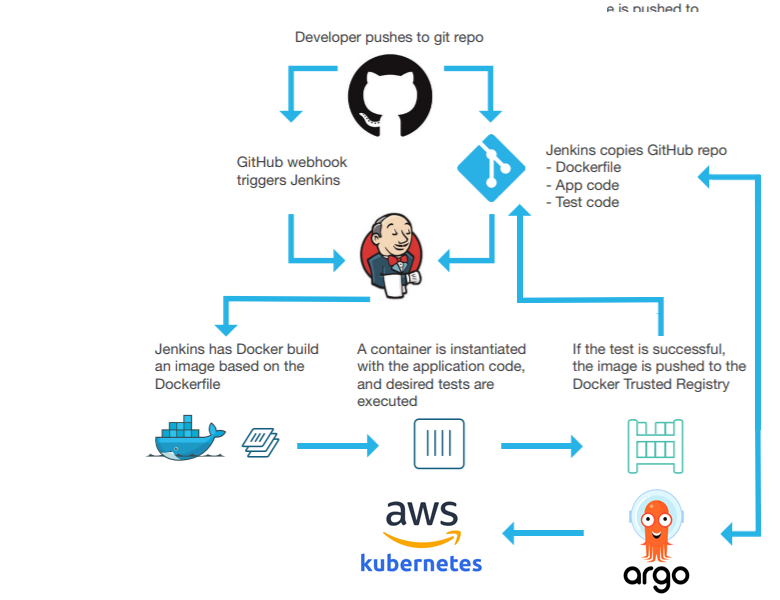
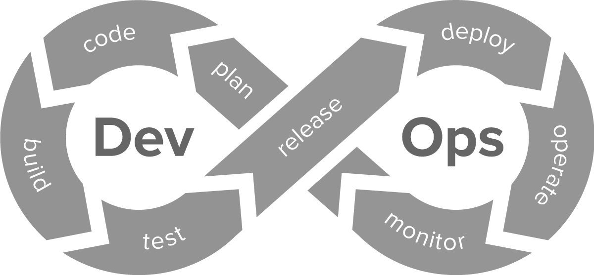

# Docker + PHP8.1.0 + Mysql 8 + Jenkins

Deployment of

 

 

 
 

### Project in progress... Pipeline building    

<table>
<tr>
<td>
Demo: <a href="#">symfony-devops.bempime-kheve.com</a> 
Sreencast demo 1min  
Source: <a href="https://github.com/Juju075/symfony-devops">Github repository</a>  
Source (deploy):  
Docker image: https://hub.docker.com/r/  
</td>
<td>
<em>
</em>

Composed by 3 containers:

1-Symfony app container with the 8.1 version of PHP.

2-Database container with a MySQL 8.0 image.

3-Jenkins container.

</td>
</tr>
</table>

##
<!--

https://img.shields.io/badge/LinkedIn-0077B5?style=for-the-badge&logo=linkedin&logoColor=white
-->

| <a href="https://github.com/Juju075/symfony-devops/blob/main/UML/databaseModeling.JPG">UML</a> |
<a href="#">Dockfile</a> | <a href="#">docker-compose</a> | <a href="#">here</a> | <a href="#">Dev-Test-Deploy</a> |

  

<table>
<tr>
<td>
<h2>Jenkinsfile</h2>
<a href="#">`📄 Pipeline script`</a>
</td>
<td>
<h2>Dockerfile</h2>
<a href="https://github.com/Juju075/symfony-devops/blob/main/Dockerfile">`📄 Dockerfile`</a>
</td>
<td>
<h2>docker-compose</h2>
<a href="https://github.com/Juju075/symfony-devops/blob/main/docker-compose.yml">`📄 docker-compose`</a>
</td>
</tr>
<tr>
<a href="#"><h2>DatabaseModel</h2></a>
 
<td>
chart
</td>
<td>ici</td>
<td>ici</td>
</tr>
</table>

<h3>How to benefit from PHPUnit?</h3>

 

Testing your code is crucial to ensure that it works as intended, meets the requirements of the end-users,  
and is free of bugs and errors.  
By catching issues early in the development process, testing can save time and resources   
Your code can also be more maintainable and free of regression. 
having a suite of automated tests that cover the functionality of your code, 
you can ensure that changes made in the future do not introduce 
new bugs or regressions. 
Ultimately, testing is an essential part of the software development process.

<iframe height="300" width="600">

</iframe>

#### Controllers

#### Entities

#### Repositories

 

## Jenkins

<h3> What is jenkins?</h3>

Jenkins is an open-source automation server used for continuous integration and continuous delivery (CI/CD) pipelines.  
It provides a platform for developers to build, test, and deploy their code in an automated and systematic way. 

Jenkins is highly configurable and supports a wide range of plugins, making it easy to integrate with various tools and technologies. 
It also has a large and active community that contributes to its development and support. 

With Jenkins, you can automate the build and testing of their code, and deploy it to production automatically or with minimal manual intervention. This helps to improve the speed, quality, and reliability of software development and deployment processes.

 

## Docker

### What problems does Docker resolve when it's time to deploy my application?

Docker is a containerization technology that can help to simplify the deployment process of applications.  

Here are some problems that Docker can resolve when deploying applications:  

<b>Dependency Management: </b> 

Docker allows you to package your application and its dependencies into a container. This ensures that the application will run consistently, 
regardless of the environment in which it is deployed.

<b>Portability:</b>  
Docker containers are lightweight and portable, meaning that you can easily move them between different environments, such as from a developer's machine to a production server.

<b>Consistency:</b>  
Docker ensures that the same environment is used in development, testing, and production, which reduces the likelihood of issues arising due to differences between environments.

<b>Scalability:</b>  
Docker can help to simplify scaling by allowing you to quickly spin up additional instances of your application in response to increased demand.

<b>Isolation:</b>  
Docker containers provide a level of isolation, meaning that if one container fails or has a security issue, it will not affect other containers running on the same host.  

Overall, Docker can help to simplify the deployment process of applications by providing a consistent and portable environment, which can reduce the likelihood of issues arising and make it easier to scale applications.

## The deployment process on a casual hosting platform.

 

### What i learned?

> use of symfony 6 release, test and deploy my app.
>
> [Bempime KHEVE](https://www.linkedin.com/in/bempime-kheve/) 
> https://img.shields.io/badge/LinkedIn-0077B5?style=for-the-badge&logo=linkedin&logoColor=white

<a href="https://github.com/Juju075/symfony-devops#docker--php810--mysql-8--jenkins">Top of page</a>

# Other projects:

<ul>
    <li><a href="https://github.com/Juju075/php_framework">custom framework inspired by Symfony</a></li>
    <li><a href="https://github.com/Juju075/api-rest">Api REST (ApiPlatform)</a></li>
    <li><a href="#">Javascript Advanced(futur project)</a></li>
    <li><a href="#">custom Framework inspired by React(futur project)</a></li>
</ul>
 
