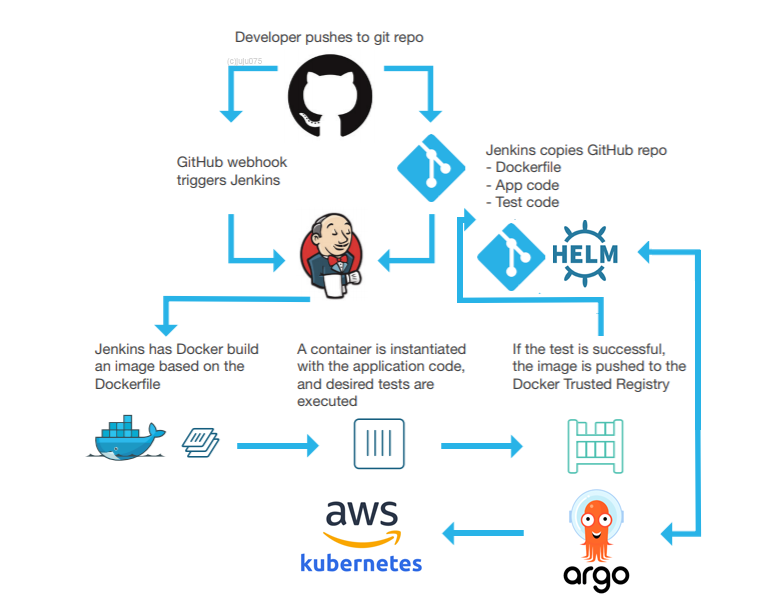

# Symfony 6 (Monolithic) + PHP 8.1.0 + MySQL 8 + Docker + Jenkins CI + Argo CD + Kubernetes + AWS

[Get linkedin devops certification]

#
  
<h3><em>Blue-Green Deployment Strategy of </em></h3>

 

### Project in progress Jenkins Pipeline & Argo settings ( AWS )...   
Issues...

    <table>
        <tr>
            <td>
                Demo: <a href="#">en attente</a> 
                Screencast demo 1min  
                Source: <a href="https://github.com/Juju075/symfony-devops">Github repository</a>  
                Source (deploy):  
                Docker image: https://hub.docker.com/r/  
            </td>
            <td>
                <em>
                </em>
                
App to deploy:

                <ul>
                <li>web app container with PHP 8.1v .</li>
                <li>Database container with a MySQL 8.0v.</li>
                </ul>
            </td>
        </tr>
    </table>

[video to gif converter here]
 

    

    

 
 

<!--

https://img.shields.io/badge/LinkedIn-0077B5?style=for-the-badge&logo=linkedin&logoColor=white
-->

| <a href="https://github.com/Juju075/symfony-devops#-what-is-jenkins">Jenkins</a> |
<a href="https://github.com/Juju075/symfony-devops#docker">Docker</a> | <a href="#">Pipeline</a> | <a href="https://github.com/Juju075/symfony-devops#the-deployment-process-on-a-casual-hosting-platform">Deployment</a> | <a href="https://github.com/Juju075/symfony-devops#other-projects">Other projects</a> |

  

<table>
    <thead>
        <tr>
            
Symfony project skills

        </tr>
    </thead>
    <tr>
    <td>
    <ul>
        <li>Twig</li>
        <li>Doctrine</li>
        <li>Event et Event Dispatcher</li>
        <li>Routing</li>
        <li>Services</li>
        <li>Serializer</li>
        <li>Embedded Forms</li>
        <li>Validators</li>
        <li>Webpacks</li>
    </ul>
<a href="https://github.com/Juju075/php-framework">Understanding the components of Symfony, check my personal php framework</a> 
</table>

    <table>
        <tr>
            <td>
            <h2>Jenkinsfile</h2>
            <a href="https://github.com/Juju075/symfony-devops/blob/kubernetes/Jenkinsfile">📄 Pipeline script</a>
            </td>
                <td>
                <h2>Dockerfile</h2>
                <a href="https://github.com/Juju075/symfony-devops/blob/main/Dockerfile">📄 Dockerfile</a>
            </td>
        <td>
            <h2>docker-compose</h2>
            <a href="https://github.com/Juju075/symfony-devops/blob/main/docker-compose.yaml">📄 docker-compose</a>
        </td>
        <td>
            <h2>clusters Kubernetes</h2>
            <a href="https://github.com/Juju075/symfony-devops/blob/main/.kube/config/kubeconfig.yaml">📄 private file for demo</a>
        </td>
        </tr>
        <tr>
            <a href="https://github.com/Juju075/symfony-devops/blob/main/UML/databaseModeling.JPG">DatabaseModel</a>
            <td>
                <a href="">📄 Workflow</a>
            </td>
        <td>
            <a href="https://github.com/Juju075/symfony-devops/blob/main/docker/docker.sh">📄 Bash init app</a>
        </td>
        <td>📄 ici</td>
        <td>
            <a href="https://github.com/Juju075/symfony-devops/tree/main/.kube/manifests">📄 Manifests</a>
        </td>
        </tr>
    </table>

<a href="#">See Application online</a>

 

 

### What i learned?

> use of symfony 6 release, test and deploy my app.
>
> [Bempime KHEVE](https://www.linkedin.com/in/bempime-kheve/) 
>
>  

<a href="https://github.com/Juju075/symfony-devops#symfony-6-monolithique--php810--mysql-8--docker--jenkins--kubernetes--aws">Top of page</a>

# Other projects:

<ul>
    <li><a href="https://github.com/Juju075/php-framework">PHP Natif - custom framework inspired by Symfony</a></li>
    <li><a href="https://github.com/Juju075/api-rest">Api REST - (ApiPlatform)</a></li>
    <li><a href="#">Javascript Advanced(futur project)</a></li>
    <li><a href="#">Microservices - Symfony microservices deployment on AWS (futur project)</a></li>
</ul>
 
